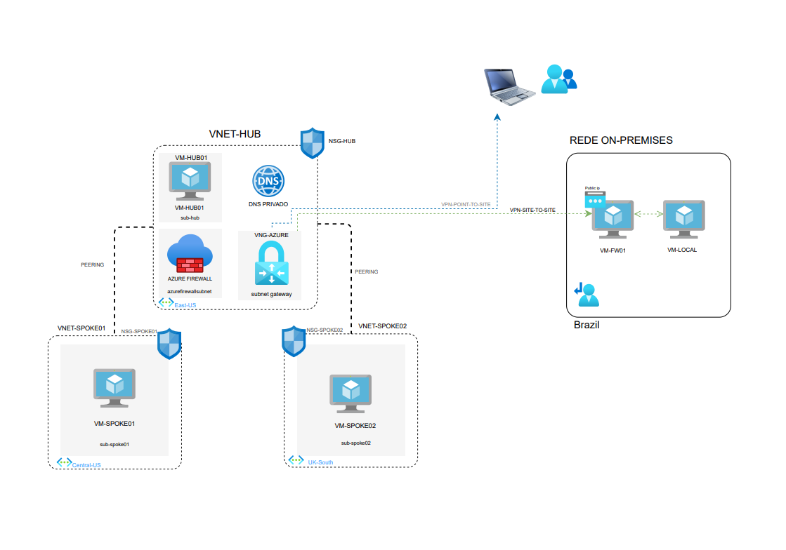

# ☁️ Azure Network Architecture: Hub-and-Spoke com Terraform

Este repositório contém a infraestrutura como código (IaC) utilizando **Terraform** para provisionar um laboratório avançado de arquitetura de redes no Microsoft Azure. Este projeto foi desenhado para simular um ambiente corporativo real, alinhado aos tópicos de certificações oficiais da Microsoft focadas em infraestrutura e redes, como AZ-104, AZ-700 e AZ-802.

A topologia baseia-se no modelo **Hub-and-Spoke**, que centraliza a segurança e a conectividade de borda, garantindo controle de tráfego eficiente enquanto isola os workloads em suas respectivas sub-redes.

## 🏗️ Arquitetura do Projeto

O laboratório automatiza a criação e integração dos seguintes componentes.




### 🌐 Redes e Conectividade
* **VNet Hub (`10.100.0.0/16` - East US):** Ponto central da rede, abrigando serviços compartilhados e appliances virtuais.
* **VNet Spoke 01 (`10.101.0.0/16` - Central US):** Ambiente de workloads focado em Windows, simulando sub-redes para servidores Web.
* **VNet Spoke 02 (`10.102.0.0/16` - UK South):** Ambiente de workloads isolado para servidores Linux.
* **VNet Peering:** Conexões estabelecidas entre o Hub e as Spokes, configuradas com transitividade de roteamento (`Allow Gateway Transit` / `Use Remote Gateways`), permitindo que as Spokes utilizem o gateway do Hub de forma centralizada.
* **Azure Virtual Network Gateway:** Implantado com SKU `VpnGw1AZ` para roteamento baseado em VPN (RouteBased), preparando a arquitetura para fechamento de túneis Site-to-Site (IPsec) e conexões Point-to-Site.

### 🔒 Segurança e Roteamento Avançado
* **Azure Firewall (Premium SKU):** Atua como o firewall de borda da topologia[cite: 2, 7]. Todo o tráfego de saída (0.0.0.0/0) originado das Spokes é interceptado e inspecionado centralmente através de **User-Defined Routes (UDRs)** atreladas às sub-redes.
* **Network Security Groups (NSGs):** Segurança a nível de sub-rede permitindo acesso de administração seguro, liberando RDP (TCP/3389) para os ambientes Windows e SSH (TCP/22) para a Spoke Linux.

### 🖥️ Computação (Workloads)
* **VM Hub:** 1x Servidor Windows Server 2022 Datacenter Azure Edition.
* **VMs Spoke 01:** 2x Servidores Windows Server 2022 (simulando clusters Web).
* **VM Spoke 02:** 1x Servidor Ubuntu Linux 22.04 LTS.
* Todas as instâncias utilizam tamanhos otimizados (`Standard_B2s`) e discos Standard SSD para balancear a relação custo/performance do laboratório.

### 🪪 Resolução de Nomes
* **Azure Private DNS Zone (`tftechcloud.com.br`):** Zonas de DNS privadas criadas e linkadas às três Virtual Networks (`Virtual Network Links`), com auto-registro habilitado, garantindo resolução automática de nomes para os nós das redes virtuais.

---

## 📁 Estrutura de Arquivos Terraform

O código foi modularizado logicamente para demonstrar boas práticas de organização, facilitando a escalabilidade do projeto:

```text
├── main.tf              # Provisionamento de IPs públicos, NICs e Instâncias Computacionais (VMs)
├── network.tf           # Definição de VNets, Subnets e links de Peering bidirecionais
├── firewall_dns_vpn.tf  # Appliances Centrais: Azure Firewall, VPN Gateway e Zonas DNS Privadas
├── security.tf          # Controles lógicos: NSGs, Security Rules e Tabelas de Roteamento (UDR)
├── variables.tf         # Arquivo de declaração de variáveis dinâmicas de infraestrutura
├── outputs.tf           # Exportação em terminal dos Endereços IP gerados pós-apply
└── providers.tf         # Declaração do Provider (AzureRM) e inicialização de backend


👨‍💻 Autor
Luis Fernando Alves Feitosa

Profissional de Infraestrutura & Cloud Azure

LinkedIn www.linkedin.com/in/luisfeitosa
